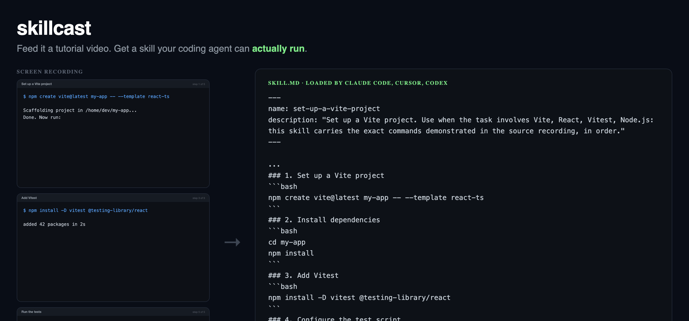

# skillcast

**Feed it a tutorial video. Get a skill your coding agent can actually run.**



```bash
skillcast vite-testing-tutorial.mp4
```

```
read vite-testing-tutorial.mp4 — 18s, 5 scene changes, 5 commands
skill: set-up-a-vite-project (5 steps)
  1. Set up a Vite project
       $ npm create vite@latest my-app -- --template react-ts
  2. Install dependencies
       $ cd my-app
       $ npm install
  3. Add Vitest
       $ npm install -D vitest @testing-library/react
  4. Configure the test script
  5. Run the tests
       $ npm run test

  wrote skill/.claude/skills/set-up-a-vite-project/SKILL.md
  wrote skill/.cursor/rules/set-up-a-vite-project.mdc
  wrote skill/AGENTS.md
```

Your agent now knows how to do the thing in the video.

---

## The idea

A developer tutorial says two different things at once.

The **narration** carries intent — *"now we'll add the test runner"*. The
**screen** carries the part you can actually run — `npm install -D vitest
@testing-library/react`.

Every video-to-text tool reaches for the transcript, and the transcript is the
half that loses the executable truth. Nobody types package names out loud.

skillcast reads the screen instead. Scene detection finds the moments the
screen changed, OCR lifts the text off those frames, and narrow heuristics
decide what was typed versus what was printed. The commands in the output are
the literal characters that were on screen.

## Why not just use a transcript

Here is the same tutorial step, both ways:

| Source | What you get |
|---|---|
| Narration | "install vitest and the testing library" |
| Screen | `npm install -D vitest @testing-library/react` |

Only one of those runs.

## Install

```bash
pipx install skillcast     # or: pip install skillcast
```

Requires [ffmpeg](https://ffmpeg.org) and
[tesseract](https://github.com/tesseract-ocr/tesseract):

```bash
brew install ffmpeg tesseract        # macOS
sudo apt install ffmpeg tesseract-ocr # Debian/Ubuntu
```

No API key. No model download. The default path is fully offline and finishes a
15-minute screencast in seconds.

## Use

```bash
skillcast demo.mp4                          # all three formats into ./skill
skillcast demo.mp4 --target claude          # just the Claude Code skill
skillcast demo.mp4 --dry-run                # show what was read, write nothing
skillcast demo.mp4 --json                   # machine-readable
skillcast demo.mp4 --threshold 0.005        # find more steps in a subtle recording
```

### Output

| Target | Path | Loaded by |
|---|---|---|
| `claude` | `.claude/skills/<name>/SKILL.md` | Claude Code |
| `cursor` | `.cursor/rules/<name>.mdc` | Cursor |
| `agents` | `AGENTS.md` | Codex, and anything that reads AGENTS.md |

Plus `skill.json` — the same content structured, if you want to render your own
format.

## It checks its own output

Generating a plausible-looking `SKILL.md` is easy, and that is the trap. OCR
misreads one flag, the file still looks fine, and your agent fails in a way
nobody traces back to the video.

So nothing ships unverified:

| Check | Catches |
|---|---|
| Structure | frontmatter a loader would actually reject |
| Syntax | commands that do not parse as shell |
| Dashes | `--template` misread as `—template`, which no CLI accepts |
| Safety | `rm -rf`, `curl \| sh`, device writes from a misread frame |
| Substance | filler text where extraction should have been |

`--strict` fails on warnings too. If `shellcheck` is installed it runs as well.

This proves the skill is loadable, runnable and not obviously dangerous. It does
not prove the tutorial was right.

## What it does not do

- It does not transcribe audio. The screen is the source of truth here; adding
  narration is planned, as enrichment rather than as the backbone.
- It does not verify that the commands work. It verifies they are well-formed.
- It does not handle videos with no visible text. If the tutorial is a talking
  head over slides, there is nothing to read.
- OCR is good, not perfect. Read the commands before running them — the output
  says so too.

## Prior art

Checked against live star counts, not memory:

| Project | Stars | Why it does not cover this |
|---|---|---|
| [screenshot-to-code](https://github.com/abi/screenshot-to-code) | 73.8k | UI screenshots → frontend code. Not workflows, not agent files. |
| [OmniParser](https://github.com/microsoft/OmniParser) | 25.2k | Parses screens into UI elements. A perception layer, not an artifact. |
| [screenpipe](https://github.com/screenpipe/screenpipe) | 20.8k | Records your screen 24/7 for recall. Passive memory, not a compiler. |
| [Agent-S](https://github.com/simular-ai/Agent-S) | 12.1k | Operates a computer live. Does not consume a video offline. |
| [OpenAdapt](https://github.com/OpenAdaptAI/OpenAdapt) | 1.7k | Demonstration → desktop RPA. Replays clicks; brittle, and not agent-readable. |
| [rulefy](https://github.com/niklub/rulefy) | 28 | Generates Cursor rules — from static code. Blind to video. |
| [RuleForge](https://github.com/he-yufeng/RuleForge) | 9 | Same, for CLAUDE.md. Also blind to video. |

The two ends exist. Reading screens is solved; writing agent rules is solved.
Nothing connects them.

## How it works

```
video ─► scene detection ─► OCR ─► command heuristics ─► skill ─► verify ─► emit
```

One detail worth stealing if you build something similar: **screencasts need a
scene threshold roughly 30× lower than ordinary video.** When a terminal
advances, only the glyphs change and the dark background dominates the frame,
so the difference score stays tiny. Measured on a terminal recording, real cuts
score 0.017–0.024. The common default of 0.3–0.4 finds *nothing* — the tool
looks broken on precisely the footage it was built for. skillcast defaults to
0.01.

## Development

```bash
python3 tests/make_fixture.py fixtures/   # build the synthetic tutorial
python3 -m unittest discover -s tests -t .
```

The fixture is a screencast whose contents are known exactly, so "it extracted
the right commands" is a measurement, not an opinion. The end-to-end tests
assert full recall and zero invented commands against that ground truth.

## Status

Early. The extraction core is tested and the output has been loaded by a real
agent, but it has been exercised on a narrow set of recordings so far. Issues
with a link to a public video are the most useful thing you can file.

---

Copyright (c) 2026 Obed Vargas. See [NOTICE.md](NOTICE.md).
