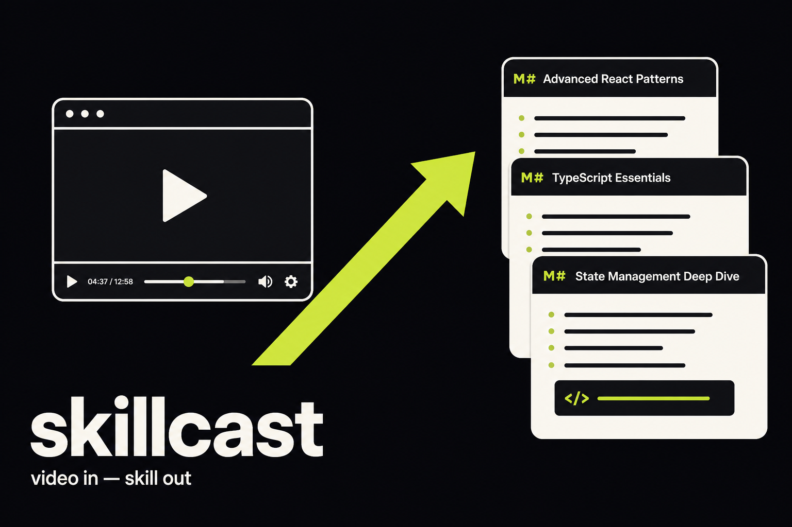

# skillcast

**Feed it a tutorial video. Get a skill your coding agent can actually run.**



### [→ Try it in your browser](https://skillcast.cloud.obeskay.com)

No install, no upload. The demo runs the same extraction client-side with
tesseract.js — your video never leaves your machine, because there is no server
for it to go to.


```bash
skillcast vite-testing-tutorial.mp4
```

```
read vite-testing-tutorial.mp4 — 18s, 5 scene changes, 5 commands
skill: set-up-a-vite-project (5 steps)
  1. Set up a Vite project
       $ npm create vite@latest my-app -- --template react-ts
  2. Install dependencies
       $ cd my-app
       $ npm install
  3. Add Vitest
       $ npm install -D vitest @testing-library/react
  4. Configure the test script
  5. Run the tests
       $ npm run test

  wrote skill/.claude/skills/set-up-a-vite-project/SKILL.md
  wrote skill/.cursor/rules/set-up-a-vite-project.mdc
  wrote skill/AGENTS.md
```

Your agent now knows how to do the thing in the video.

---

## The idea

A developer tutorial says two different things at once.

The **narration** carries intent — *"now we'll add the test runner"*. The
**screen** carries the part you can actually run — `npm install -D vitest
@testing-library/react`.

Every video-to-text tool reaches for the transcript, and the transcript is the
half that loses the executable truth. Nobody types package names out loud.

skillcast reads both. Scene detection finds the moments the screen changed,
OCR lifts the text off those frames, and narrow heuristics decide what was
typed versus what was printed. When a subtitle track is available, its
narration is aligned to those same moments as context. Commands in the output
are still the literal characters that were on screen.

## Why not just use a transcript

Here is the same tutorial step, both ways:

| Source | What you get |
|---|---|
| Narration | "install vitest and the testing library" |
| Screen | `npm install -D vitest @testing-library/react` |

Only one of those runs.

## Install

```bash
pip install git+https://github.com/obeskay/skillcast
```

> The PyPI name `skillcast` is taken by an unrelated project, so the package will
> publish as **`skillcast-cli`** — the command stays `skillcast`. Until it is on
> PyPI, install from git as above.

Requires [ffmpeg](https://ffmpeg.org) and
[tesseract](https://github.com/tesseract-ocr/tesseract):

```bash
brew install ffmpeg tesseract        # macOS
sudo apt install ffmpeg tesseract-ocr # Debian/Ubuntu
```

No API key. No model download. The default path is fully offline and finishes a
15-minute screencast in seconds.

## Use

```bash
skillcast https://youtube.com/watch?v=...   # paste a link
skillcast demo.mp4                          # or a local file
skillcast demo.mp4                          # all three formats into ./skill
skillcast demo.mp4 --target claude          # just the Claude Code skill
skillcast demo.mp4 --dry-run                # show what was read, write nothing
skillcast demo.mp4 --json                   # machine-readable
skillcast demo.mp4 --threshold 0.005        # find more steps in a subtle recording
skillcast demo.mp4 --narration               # use a local subtitle sidecar
skillcast demo.mp4 --no-narration            # screen-only extraction
```

### Links

A URL works anywhere a path does — YouTube, Vimeo, Loom, or a direct `.mp4`.
It needs [yt-dlp](https://github.com/yt-dlp/yt-dlp) (`pip install yt-dlp`) and
downloads at 720p, which is plenty for OCR and far quicker.

For a URL, skillcast asks yt-dlp for English subtitles first, then the video's
available language if English is not present. Missing subtitles are fine. For
a local file, put `video.vtt` or `video.srt` beside `video.mp4`; local videos
without that sidecar stay screen-only unless a sidecar is present.

YouTube blocks anonymous downloads in waves. When it does, the error says so and
gives you the way through rather than looking like a broken link:

```bash
skillcast "https://youtube.com/watch?v=..." --cookies-from-browser chrome
```

The browser demo can only fetch URLs that allow cross-origin reads, which
YouTube does not — there it hands you the CLI command instead of failing
silently.

### Output

| Target | Path | Loaded by |
|---|---|---|
| `claude` | `.claude/skills/<name>/SKILL.md` | Claude Code |
| `cursor` | `.cursor/rules/<name>.mdc` | Cursor |
| `agents` | `AGENTS.md` | Codex, and anything that reads AGENTS.md |

Plus `skill.json` — the same content structured, if you want to render your own
format.

## It checks its own output

Generating a plausible-looking `SKILL.md` is easy, and that is the trap. OCR
misreads one flag, the file still looks fine, and your agent fails in a way
nobody traces back to the video.

So nothing ships unverified:

| Check | Catches |
|---|---|
| Structure | frontmatter a loader would actually reject |
| Syntax | commands that do not parse as shell |
| Dashes | `--template` misread as `—template`, which no CLI accepts |
| Safety | `rm -rf`, `curl \| sh`, device writes from a misread frame |
| Substance | filler text where extraction should have been |

`--strict` fails on warnings too. If `shellcheck` is installed it runs as well.

This proves the skill is loadable, runnable and not obviously dangerous. It does
not prove the tutorial was right.

## Narration and guide skills

Narration is enrichment for a terminal tutorial: each step can carry a short
quoted subtitle note with its video timestamp. The command remains the
backbone, so prose never becomes an invented shell instruction.

If a tutorial has no commands but does have subtitles, skillcast emits a guide
with `kind: guide`. Chapters become steps when the video supplies them;
otherwise the narration is grouped into roughly 60–90 second sections. Each
section records what was said, what text was visible on screen, and explicit
shortcuts such as `Ctrl+S` or “press G”. A guide tells your agent what the
tutorial teaches and where to look. It does not replay clicks or operate the
computer.

Two honest limits, learned on real Blender tutorials. YouTube's auto-captions
arrive as rolling windows that repeat every sentence; skillcast strips the
overlap before aligning anything, or guides read tripled. And on a 720p
software viewport most labels are too small to read — on-screen evidence must
contain a real interface word to earn its place, so many guides are
narration-plus-shortcuts only, and say so.

## Learning routes

Pass a playlist when the goal is a sequence rather than one skill:

```bash
skillcast route "https://www.youtube.com/playlist?list=..." \
  "learn Blender from the basics" --sort general-first --limit 8
```

The curator's order is kept by default. `general-first` applies a stable title
heuristic that moves introductions and fundamentals earlier and advanced or
masterclass videos later. Each video is processed independently, so a failed
video is recorded in `ROUTE.md` while the rest of the route continues. A
real-shaped route looks like this:

```text
# learn blender from the basics

## Curriculum

1. Blender basics — 12m 04s (cumulative 12m 04s)
   What you'll be able to do: Blender interface overview
   Skill: [SKILL.md](01-blender-basics/.claude/skills/blender-basics/SKILL.md)
2. Model a flower — 18m 22s (cumulative 30m 26s)
   What you'll be able to do: Create the first petals
   Skill: [SKILL.md](02-model-a-flower/.claude/skills/model-a-flower/SKILL.md)

## Give this route to your agent

Learn this route: 01-blender-basics/.claude/skills/blender-basics/SKILL.md, \
02-model-a-flower/.claude/skills/model-a-flower/SKILL.md in order.
```

## Replay packs (early, macOS only)

A guide's shortcuts are literal keystrokes, so skillcast can hand them back to
your machine. `skillcast replay ./skill` writes `<name>.peekaboo.json`: every
shortcut becomes a Peekaboo hotkey step, and every keyless step becomes a
pause — a checkpoint where you do the clicking the narrator showed — paced the
way the video paced them.

```bash
skillcast replay ./skill --pace-ms 5000
peekaboo run model-a-flower.peekaboo.json --no-remote
```

Needs [Peekaboo](https://github.com/steipete/peekaboo) (`brew install
steipede/tap/peekaboo`) with its macOS permissions granted. `--run` executes
immediately — real keystrokes into the frontmost app, so focus the right one
first. The script shape is what installed Peekaboo builds (3.0.0) actually
decode; it was probed live, not copied from docs.

It presses the keys the narrator pressed. It does not click: nothing about a
recording tells it where your buttons are. That is why checkpoints pause
instead of guess.

## How well it holds up

Measured on the fixture, degraded on purpose. Recall is exact-match against
known ground truth:

| Recording | Recall |
|---|---|
| 720p terminal, large type | 5/5 |
| Re-encoded at 360p, crf 30 | 5/5 |
| Heavy noise added | 5/5 |
| IDE-style, 22px type amid code | 4/5 |
| IDE-style, 16px type amid code | 4/5 |
| IDE-style, 13px type | 2/5 |
| IDE-style, 11px type | 1/5 |

Compression barely matters; **type size does**. Below roughly 16px of on-screen
text the OCR starts dropping commands, and no scene threshold rescues it.

If you control the recording: record at 1080p or above, and bump the terminal
font. If you do not, expect to review the output rather than trust it.

Detection adapts on its own. A single command appearing in a screen already
full of code scores 0.0001–0.002 — another order of magnitude below a bare
terminal — so when the first pass comes back sparse for the video's length,
skillcast retries ten times more sensitive, then falls back to interval
sampling. It never silently returns one frame for a ten-minute tutorial.

## What it needs from the recording

It reads **terminals and editors**. That is the whole scope, and it is worth being
blunt about it: a recording of hands, a phone video, slides or a talking head has
nothing for it to lift. Point it at one and it says so rather than inventing steps
— if not one candidate command uses a program it recognises, it refuses outright.

That check exists because it once did the wrong thing: fed a phone video, it
produced `'a` and `B` as commands and reported "no problems found". A prompt
character followed by anything was passing straight through.

## What it does not do

- It does not turn narration into executable commands. Commands must be visible
  on screen and pass the same recognition gate as before.
- It does not verify that the commands work. It verifies they are well-formed.
- It does not click during replay. Packs press the keys the narration named;
  where your buttons are is yours to know.
- OCR is good, not perfect. Read the commands before running them — the output
  says so too.

## Prior art

Checked against live star counts, not memory:

| Project | Stars | Why it does not cover this |
|---|---|---|
| [screenshot-to-code](https://github.com/abi/screenshot-to-code) | 73.8k | UI screenshots → frontend code. Not workflows, not agent files. |
| [OmniParser](https://github.com/microsoft/OmniParser) | 25.2k | Parses screens into UI elements. A perception layer, not an artifact. |
| [screenpipe](https://github.com/screenpipe/screenpipe) | 20.8k | Records your screen 24/7 for recall. Passive memory, not a compiler. |
| [Agent-S](https://github.com/simular-ai/Agent-S) | 12.1k | Operates a computer live. Does not consume a video offline. |
| [OpenAdapt](https://github.com/OpenAdaptAI/OpenAdapt) | 1.7k | Demonstration → desktop RPA. Replays clicks; brittle, and not agent-readable. |
| [rulefy](https://github.com/niklub/rulefy) | 28 | Generates Cursor rules — from static code. Blind to video. |
| [RuleForge](https://github.com/he-yufeng/RuleForge) | 9 | Same, for CLAUDE.md. Also blind to video. |

The two ends exist. Reading screens is solved; writing agent rules is solved.
Nothing connects them.

## How it works

```
video ─► scene detection ─► OCR ─► commands + narration ─► skill ─► verify ─► emit
playlist ─► ordered videos ─► skills ─► ROUTE.md
guide ─► replay pack ─► peekaboo (the keys the narrator pressed)
```

One detail worth stealing if you build something similar: **screencasts need a
scene threshold roughly 30× lower than ordinary video.** When a terminal
advances, only the glyphs change and the dark background dominates the frame,
so the difference score stays tiny. Measured on a terminal recording, real cuts
score 0.017–0.024. The common default of 0.3–0.4 finds *nothing* — the tool
looks broken on precisely the footage it was built for. skillcast defaults to
0.01.

## Development

```bash
python3 tests/make_fixture.py fixtures/   # build the synthetic tutorial
python3 -m unittest discover -s tests -t .
```

The fixture is a screencast whose contents are known exactly, so "it extracted
the right commands" is a measurement, not an opinion. The end-to-end tests
assert full recall and zero invented commands against that ground truth.

## Status

Early. The extraction core is tested and the output has been loaded by a real
agent, but it has been exercised on a narrow set of recordings so far. Issues
with a link to a public video are the most useful thing you can file.

What the first live runs broke and taught: [docs/learnings.md](docs/learnings.md).

### Roadmap

Replay packs (v0.3.0) press the keys the narrator pressed. What remains is the
clicking: resolving on-screen evidence to live UI elements on your machine,
so a replay can act where the tutorial acted instead of pacing while you do.

---

MIT — see [LICENSE](LICENSE). Contributions welcome.
